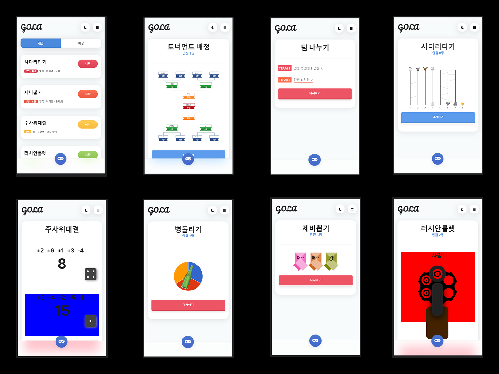

### GoLa: 인원 선별 서비스

[프로젝트 회고록](https://jisulog.com/docs/essay/project-review/2020-gola)

## 개요
GoLa(골라)는 여러분의 모임이나 파티를 더욱 재미있게 만들어 줄 서비스입니다. 
친구들과의 모임에서 재미있는 미니 게임으로 분위기를 띄우거나, 
스포츠 대회나 회사 워크샵에서 팀을 빠르게 나누고 대진표를 작성해보세요. 
또한, 선물 추첨이나 임의의 결정을 위한 게임으로 선택의 어려움을 줄여줍니다.

## 설치 및 실행 방법
> [demo](https://gola.egoist.im/)

## 주요 기능
- 미니 게임(사다리타기, 제비뽑기, 주사위게임, 러시안룰렛, 화살표룰렛)을 할 수 있다.
- 배정(팀 나누기, 토너먼트 대진표)을 이용 할 수 있다.

## 기술 스택
- **언어**
    - Javascript
    - HTML/CSS
- **프레임워크**
    - Spring Framework
- **Library**
    - jQuery
    - Bootstrap
- **IDE**
    - Eclipse

## 라이선스
Copyright © 2020. [EGO CREW](https://ego.so/). All rights reserved.